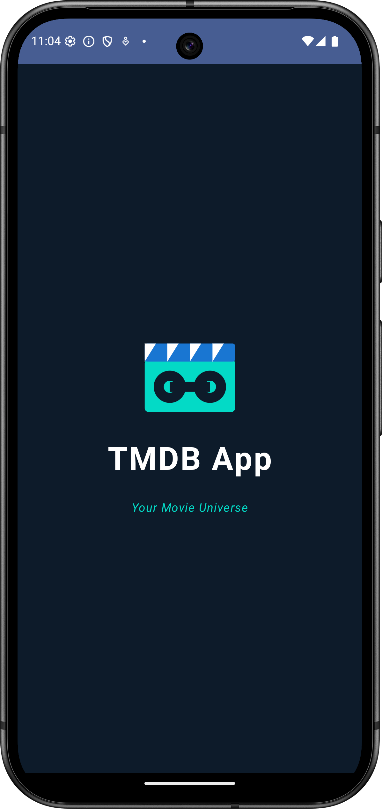
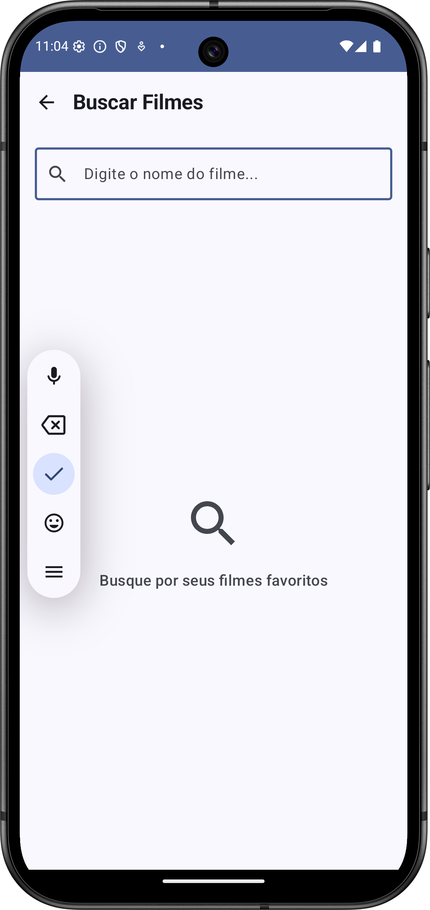
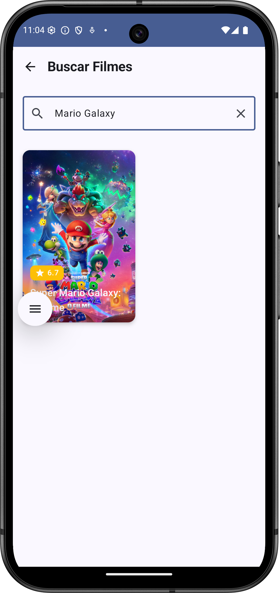
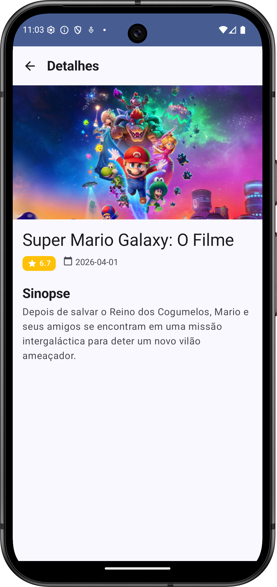

# 📱 TMDB App - Android

<div align="center">


A modern Android application that consumes the **The Movie Database (TMDB)** API to display popular movie information, following Android development best practices.

[Features](#-features) • [Architecture](#-architecture) • [Tech Stack](#-tech-stack) • [Getting Started](#-getting-started) • [Tests](#-tests)

</div>

---

## 📋 Table of Contents

- [Screenshots](#-screenshots)
- [Features](#-features)
- [Architecture](#-architecture)
- [Tech Stack](#-tech-stack)
- [Project Structure](#-project-structure)
- [Getting Started](#-getting-started)
- [API Configuration](#-api-configuration)
- [Tests](#-tests)
- [Technical Decisions](#-technical-decisions)
- [Future Improvements](#-future-improvements)
- [Contributing](#-contributing)
- [License](#-license)

---

## 📸 Screenshots

<div align="center">

<table>
  <tr>
    <td align="center"><b>Splash Screen</b></td>
    <td align="center"><b>Search Movies</b></td>
    <td align="center"><b>Search Results</b></td>
  </tr>
  <tr>
    <td></td>
    <td></td>
    <td></td>
  </tr>
  <tr>
    <td align="center"><b>Movie Details</b></td>
    <td align="center"><b>Popular Movies</b></td>
    <td></td>
  </tr>
  <tr>
    <td></td>
    <td></td>
  </tr>
</table>

</div>

---

## ✨ Features

### 🏠 **Home Screen**
- ✅ List of popular movies from TMDB
- ✅ Infinite scroll with automatic pagination
- ✅ Local cache for offline mode
- ✅ Pull-to-refresh
- ✅ Loading indicators

### 🔍 **Movie Search**
- ✅ Real-time search with debounce
- ✅ Dynamic results
- ✅ Empty and error states handled
- ✅ Minimum 3 characters to search

### 🎬 **Movie Details**
- ✅ Full information (title, synopsis, rating)
- ✅ High quality images (poster + backdrop)
- ✅ Release date
- ✅ Rating with dynamic colors

### 🎨 **UI/UX**
- ✅ Material Design 3
- ✅ Dark/Light theme (dynamic support)
- ✅ Smooth animations
- ✅ Reusable components
- ✅ Responsive design

### 🔄 **Technical Features**
- ✅ Offline mode with Room cache
- ✅ Robust error handling
- ✅ Loading states across all flows
- ✅ Retry on failure
- ✅ Scalable and testable architecture

---

## 🏗 Architecture

The project follows **Clean Architecture** principles combined with the **MVVM** (Model-View-ViewModel) pattern, ensuring separation of concerns and ease of maintenance.

```
┌─────────────────────────────────────────────────────────┐
│                   PRESENTATION LAYER                     │
│  (UI + ViewModels + Navigation + Compose Screens)       │
└────────────────────┬────────────────────────────────────┘
                     │
                     ▼
┌─────────────────────────────────────────────────────────┐
│                    DOMAIN LAYER                          │
│        (Use Cases + Models + Repository Interface)      │
└────────────────────┬────────────────────────────────────┘
                     │
                     ▼
┌─────────────────────────────────────────────────────────┐
│                     DATA LAYER                           │
│    (Repository Impl + Remote + Local + Mappers)         │
└─────────────────────────────────────────────────────────┘
```

### Project Layers

#### 📱 **Presentation Layer**
- **Responsibility**: UI and user interaction
- **Components**:
  - `Composables` (Screens and Components)
  - `ViewModels` (state management)
  - `Navigation` (screen navigation)
  - `UiState` (interface states)

#### 🧠 **Domain Layer**
- **Responsibility**: Business logic
- **Components**:
  - `Models` (domain entities)
  - `Use Cases` (business use cases)
  - `Repository Interfaces` (contracts)

#### 💾 **Data Layer**
- **Responsibility**: Data access and manipulation
- **Components**:
  - `Repository Implementation`
  - `Remote Data Source` (API)
  - `Local Data Source` (Room)
  - `DTOs` and `Mappers`

---

## 🛠 Tech Stack

### **Core**
-  - Primary language
-  - Minimum Android 7.0

### **UI**
- **Jetpack Compose** - Modern declarative UI
- **Material 3** - Design system
- **Coil** - Image loading
- **Navigation Compose** - Navigation

### **Architecture & DI**
- **Hilt** - Dependency injection
- **ViewModel** - State management
- **StateFlow** - Reactive data flow
- **Coroutines** - Asynchronous programming

### **Networking**
- **Retrofit** - HTTP client
- **OkHttp** - Interceptors and logging
- **Kotlinx Serialization** - JSON serialization

### **Persistence**
- **Room** - Local database
- **Paging 3** - Efficient pagination

### **Build & Configuration**
- **Gradle Version Catalog** - Dependency management
- **Kotlin DSL** - Typed Gradle scripts

### **Tests**
- **JUnit 4** - Testing framework
- **MockK** - Mocking for Kotlin
- **Turbine** - Flow testing
- **Coroutines Test** - Async testing

---

## 📁 Project Structure

```
com.sbaldasso.tmdbapp/
│
├── 📂 data/                          # Data Layer
│   ├── 📂 local/                     # Local persistence
│   │   ├── dao/                      # Data Access Objects
│   │   ├── entity/                   # Room entities
│   │   ├── mapper/                   # Entity ↔ Domain mappers
│   │   └── AppDatabase.kt            # Room configuration
│   ├── 📂 remote/                    # Remote source (API)
│   │   ├── api/                      # Retrofit services
│   │   ├── dto/                      # Data Transfer Objects
│   │   └── mapper/                   # DTO ↔ Domain mappers
│   ├── 📂 paging/                    # Paging 3 sources
│   └── 📂 repository/                # Repository implementations
│
├── 📂 domain/                        # Domain Layer
│   ├── 📂 model/                     # Business models
│   ├── 📂 repository/                # Repository interfaces
│   └── 📂 usecase/                   # Use cases
│
├── 📂 presentation/                  # Presentation Layer
│   ├── 📂 component/                 # Reusable components
│   ├── 📂 navigation/                # Navigation configuration
│   ├── 📂 screen/                    # App screens
│   │   ├── home/                     # Home screen + ViewModel
│   │   ├── details/                  # Details screen + ViewModel
│   │   └── search/                   # Search screen + ViewModel
│   └── 📂 state/                     # Generic UI states
│
├── 📂 di/                            # Dependency Injection
│   ├── DatabaseModule.kt             # Room module
│   ├── NetworkModule.kt              # Retrofit module
│   └── RepositoryModule.kt           # Repository module
│
├── 📂 ui/                            # UI Theme
│   └── theme/                        # Material Theme config
│
├── MainActivity.kt                   # Main activity
└── TmdbApplication.kt               # Application class
```

---

## 🚀 Getting Started

### **Prerequisites**

- ✅ Android Studio Hedgehog (2023.1.1) or higher
- ✅ JDK 17
- ✅ Android SDK (API 34)
- ✅ TMDB API Key ([get it here](https://www.themoviedb.org/settings/api))

### **Step by Step**

1. **Clone the repository**
```bash
git clone https://github.com/samuelbaldasso/Android-TMDB-App.git

cd Android-TMDB-App
```

2. **Configure the API Key**

Create/edit the `local.properties` file at the project root:

```properties
# Android SDK path (auto-generated)
sdk.dir=/path/to/Android/sdk

# TMDB API Key
TMDB_API_KEY=your_api_key_here
```

> ⚠️ **Important**: Never commit the `local.properties` file! It is already in `.gitignore`.

3. **Sync and Build**

In Android Studio:
- File → Sync Project with Gradle Files
- Build → Make Project

Or via terminal:
```bash
./gradlew clean build
```

4. **Run the App**

- Connect a physical device or start an emulator
- Run → Run 'app'

Or via terminal:
```bash
./gradlew installDebug
```

---

## 🔑 API Configuration

### **Getting a TMDB API Key**

1. Visit [TMDB](https://www.themoviedb.org/)
2. Create a free account
3. Go to **Settings → API**
4. Request an API Key (choose "Developer")
5. Copy the API Key (v3 auth)

### **Endpoints Used**

| Endpoint | Description | Method |
|----------|-------------|--------|
| `/movie/popular` | List popular movies | GET |
| `/movie/{id}` | Movie details | GET |
| `/search/movie` | Search movies by query | GET |

**Base URL**: `https://api.themoviedb.org/3/`

**Authentication**: API Key via query parameter

---

## 🧪 Tests

### **Running Tests**

```bash
# All tests
./gradlew test

# Unit tests
./gradlew testDebugUnitTest

# Tests with coverage
./gradlew testDebugUnitTest jacocoTestReport
```

### **Test Structure**

```
test/
├── domain/usecase/
│   ├── GetPopularMoviesUseCaseTest.kt
│   ├── GetMovieDetailsUseCaseTest.kt
│   └── SearchMoviesUseCaseTest.kt
├── presentation/screen/
│   ├── home/HomeViewModelTest.kt
│   ├── details/DetailsViewModelTest.kt
│   └── search/SearchViewModelTest.kt
└── data/repository/
    └── MovieRepositoryImplTest.kt
```

### **Test Coverage**

- ✅ ViewModels (states and flows)
- ✅ Use Cases (business logic)
- ✅ Repository (API and cache integration)
- ✅ Mappers (data conversions)

---

## 💡 Technical Decisions

### **Why Jetpack Compose?**
- Declarative and reactive UI
- Less boilerplate code
- Real-time preview
- Native ViewModel integration

### **Why Clean Architecture?**
- Clear separation of concerns
- Easier unit testing
- More maintainable code
- Framework independence

### **Why Hilt?**
- Official Android DI solution
- Perfect ViewModel integration
- Lower learning curve
- Boilerplate reduction

### **Why Room + Retrofit?**
- **Room**: Robust local caching
- **Retrofit**: Most widely used HTTP client
- **Strategy**: Network-first with cache fallback

### **Why StateFlow?**
- Simpler API than LiveData
- Compose compatible
- Native Coroutines support
- Type-safe

### **Cache Strategy**
```kotlin
1. Try to fetch from API
   ↓
2. Save to Room (cache)
   ↓
3. Return data
   ↓
4. On failure → fetch from cache
```

---

## 🔮 Future Improvements

### **Features**
- [ ] ⭐ Favorites system
- [ ] 🎭 Movie categories (action, comedy, etc.)
- [ ] 🎬 Trailers and videos
- [ ] 👤 User profile
- [ ] 🌐 Multi-language (i18n)

### **Technical**
- [ ] 🧪 Instrumented tests (UI)
- [ ] ✨ Shimmer loading effect
- [ ] 🎨 Advanced animations
- [ ] 📱 Tablet support
- [ ] 🔔 New movie notifications

### **Optimizations**
- [ ] ⚡ Optimized App Startup
- [ ] 📦 App modularization
- [ ] 🗜 Image compression with WebP
- [ ] 🔄 WorkManager for background sync
- [ ] 📊 Analytics and Crashlytics

---

## 📊 Performance

### **Metrics**

| Metric | Value | Status |
|--------|-------|--------|
| APK Size | ~8 MB | ✅ Optimized |
| Startup Time | < 2s | ✅ Fast |
| Memory Usage | ~50 MB | ✅ Efficient |
| Network Calls | Cached | ✅ Optimized |

### **Implemented Optimizations**

- ✅ **LazyColumn/Grid**: On-demand rendering
- ✅ **Coil Cache**: In-memory/disk image cache
- ✅ **Room Cache**: Reduces network calls
- ✅ **Paging 3**: Incremental loading
- ✅ **Debounce**: Reduces search requests
- ✅ **Coroutines**: Efficient async operations

---

## 🐛 Troubleshooting

### **Error: API Key not found**

**Problem**: `BuildConfig.TMDB_API_KEY` returns an empty string

**Solution**:
1. Check that the `local.properties` file exists
2. Confirm the key is correct: `TMDB_API_KEY=your_key`
3. Sync Gradle: `File → Sync Project with Gradle Files`
4. Rebuild: `Build → Rebuild Project`

---

### **Error: Network Security Exception**

**Problem**: App cannot make HTTP requests

**Solution**: TMDB uses HTTPS by default, but if needed add to `AndroidManifest.xml`:

```xml
<application
    android:usesCleartextTraffic="true"
    ...>
```

---

### **Error: Room Schema Export**

**Problem**: Warnings about schema export

**Solution**: Add to `build.gradle.kts`:

```kotlin
ksp {
    arg("room.schemaLocation", "$projectDir/schemas")
}
```

---

### **Error: Compose Preview not working**

**Problem**: Previews not loading

**Solution**:
1. Invalidate caches: `File → Invalidate Caches → Invalidate and Restart`
2. Update Android Studio to the latest version
3. Check that `@Preview` is being used correctly

---

## 📱 Compatibility

| Android Version | API Level | Support |
|-----------------|-----------|---------|
| Android 14 | 34 | ✅ Full |
| Android 13 | 33 | ✅ Full |
| Android 12 | 31-32 | ✅ Full |
| Android 11 | 30 | ✅ Full |
| Android 10 | 29 | ✅ Full |
| Android 9 | 28 | ✅ Full |
| Android 8 | 26-27 | ✅ Full |
| Android 7 | 24-25 | ✅ Full |

**Minimum SDK**: 24 (Android 7.0 - Nougat)  
**Target SDK**: 34 (Android 14)

---

## 🔒 Security

### **Implemented Practices**

✅ **Secure API Key**
- Stored in `local.properties` (not versioned)
- Injected at build time via BuildConfig
- Never exposed in source code

✅ **Network Security**
- HTTPS by default
- Certificate pinning (optional)
- Configured timeout (30s)

✅ **Data Protection**
- Encrypted local cache (optional with SQLCipher)
- Old cache cleanup (> 7 days)

✅ **ProGuard/R8**
```properties
# Obfuscates code in release
-keepattributes *Annotation*
-keep class com.sbaldasso.tmdbapp.** { *; }
```

---

## 📖 Additional Documentation

### **Useful Resources**

- 📚 [TMDB API Documentation](https://developers.themoviedb.org/3)
- 🎨 [Material Design 3](https://m3.material.io/)
- 🚀 [Jetpack Compose Docs](https://developer.android.com/jetpack/compose)
- 💉 [Hilt Documentation](https://dagger.dev/hilt/)
- 🗄️ [Room Documentation](https://developer.android.com/training/data-storage/room)

### **Tutorials**

- [Clean Architecture in Android](https://blog.cleancoder.com/uncle-bob/2012/08/13/the-clean-architecture.html)
- [MVVM with Jetpack Compose](https://developer.android.com/topic/architecture)
- [Paging 3 with Compose](https://developer.android.com/topic/libraries/architecture/paging/v3-overview)

---

## 👥 Contributing

Contributions are always welcome! 🎉

### **How to Contribute**

1. **Fork** the project
2. **Create** a branch for your feature
   ```bash
   git checkout -b feature/MyFeature
   ```
3. **Commit** your changes
   ```bash
   git commit -m 'feat: Add new feature'
   ```
4. **Push** to the branch
   ```bash
   git push origin feature/MyFeature
   ```
5. **Open** a Pull Request

### **Commit Standards**

We follow [Conventional Commits](https://www.conventionalcommits.org/):

```
feat: New feature
fix: Bug fix
docs: Documentation
style: Formatting
refactor: Refactoring
test: Tests
chore: Maintenance
```

### **Code Style**

- ✅ Use the default Kotlin formatter
- ✅ Follow naming conventions
- ✅ Document public functions
- ✅ Write tests for new features

---

## 🙏 Acknowledgements

- [The Movie Database (TMDB)](https://www.themoviedb.org/) - Movie API
- [Google Android Team](https://developer.android.com/) - Jetpack Libraries
- [Square](https://square.github.io/) - Retrofit & OkHttp
- Android Community 🌎

---

## 👨‍💻 Author

**Samuel Baldasso**

- GitHub: [@samuelbaldasso](https://github.com/samuelbaldasso)
- LinkedIn: [Samuel Baldasso](https://linkedin.com/in/samuel-baldasso-java-developer)

---

## 📄 License

This project is licensed under the MIT License. See the [LICENSE](LICENSE) file for more details.

```
MIT License

Copyright (c) 2026 - Samuel Baldasso

Permission is hereby granted, free of charge, to any person obtaining a copy
of this software and associated documentation files (the "Software"), to deal
in the Software without restriction, including without limitation the rights
to use, copy, modify, merge, publish, distribute, sublicense, and/or sell
copies of the Software, and to permit persons to whom the Software is
furnished to do so, subject to the following conditions:

The above copyright notice and this permission notice shall be included in all
copies or substantial portions of the Software.

THE SOFTWARE IS PROVIDED "AS IS", WITHOUT WARRANTY OF ANY KIND, EXPRESS OR
IMPLIED, INCLUDING BUT NOT LIMITED TO THE WARRANTIES OF MERCHANTABILITY,
FITNESS FOR A PARTICULAR PURPOSE AND NONINFRINGEMENT. IN NO EVENT SHALL THE
AUTHORS OR COPYRIGHT HOLDERS BE LIABLE FOR ANY CLAIM, DAMAGES OR OTHER
LIABILITY, WHETHER IN AN ACTION OF CONTRACT, TORT OR OTHERWISE, ARISING FROM,
OUT OF OR IN CONNECTION WITH THE SOFTWARE OR THE USE OR OTHER DEALINGS IN THE
SOFTWARE.
```

---

<div align="center">

**[⬆ Back to top](#-tmdb-app---android)**

---

Made with ❤️ and ☕ by [Samuel Baldasso](https://github.com/samuelbaldasso)

**⭐ If this project was helpful, leave a star!**

</div>
